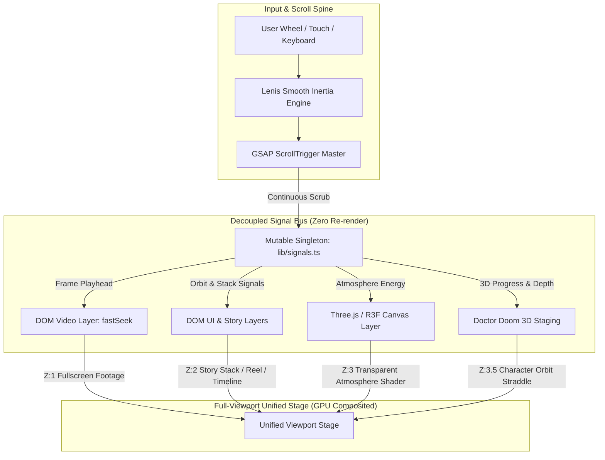

# AVENGERS: DOOMSDAY — Cinematic Scroll Experience

<div align="center">


**An Awwwards-style, scroll-driven cinematic web experience engineered with Next.js, React Three Fiber, and GSAP.**

[Live Demo](#-deployment) • [Architecture](#-technical-architecture) • [Features](#-cinematic-features) • [Getting Started](#-getting-started) • [Performance](#-performance--optimization)

</div>

---

## ✦ Executive Summary

**AVENGERS: DOOMSDAY** is an immersive, high-performance web experience that bridges real-time 3D graphics and frame-accurate video playback into a cohesive cinematic narrative. Rather than treating scroll as standard document navigation, the user's scroll position acts as a virtual camera track and timeline playhead.

Every visual element — GPU particle volumes, volumetric smoke shaders, procedural fractal lightning, 3D character staging, and 4K trailer streams — is synchronized through a decoupled, zero-allocation signal architecture.

> **Disclaimer**: This is an independent, non-commercial fan concept built for educational, portfolio, and creative engineering purposes. Not affiliated with, endorsed by, or sponsored by Marvel Studios or The Walt Disney Company. All trademarks and characters belong to their respective copyright holders.

---

## ✦ System Architecture



---

## ✦ Cinematic Journey & Chapters

| Chapter | Milestones | Core Mechanics & Choreography |
| :--- | :--- | :--- |
| **01. The Void & Storm** | `0.0 – 1.4 units` | Deep void particles swirl with simplex noise; green storm energy ramps up; procedural fractal lightning bolts strike with camera shake. |
| **02. Marvel Intro** | `1.4 – 3.8 units` | The iconic Marvel intro trailer scrubs frame-by-frame backwards/forwards with sub-frame precision. |
| **03. The Rift Portal** | `3.9 – 4.7 units` | Polar-coordinate FBM energy tunnel opens, camera executes forward dolly plunge, website chrome smoothly enters. |
| **04. Hero Doom Trailer** | `5.2 – 11.2 units` | Narrative text beats reveal sequentially, followed by the Doctor Doom trailer playing synchronously with scroll input. |
| **05. 3D Doom Showcase** | `11.8 – 16.5 units` | Procedural 3D Doctor Doom figure rises with metallic shaders; 6 character video cards orbit the model in true 3D depth. |
| **06. Story Stack** | `16.8 – 23.4 units` | 6 full-bleed movie-poster panels (Doom, Thor, Loki, Cyclops, Shang-Chi, Fantastic Four) rise and stack sequentially. |
| **07. Horizontal Timeline** | `24.5 – 31.3 units` | Vertical scroll seamlessly translates into horizontal timeline travel with parallax depth on cinematic scenes. |
| **08. The Finale & MCU Road**| `31.7 – 47.6 units` | Scroll-scrubbed battle sequence transitions into the vertical MCU Timeline pan, culminating in the **AVENGERS: DOOMSDAY** title reveal. |

---

## ✦ Key Engineering Innovations

### 1. Zero-Allocation Signal Bus (`signals.ts`)
React re-renders in the scroll hot path inevitably cause micro-stutter. The engine utilizes a mutable singleton bus updated directly by GSAP tweens and read during `useFrame` (WebGL) and a single synchronized `useRaf` loop (DOM overlays). This guarantees **zero garbage collection pressure and zero React re-renders** during active scrolling.

### 2. High-Performance Frame-Accurate Video Scrubbing
- **All-Intra / FastSeek Encoding**: Trailers are indexed so every frame can be seeked instantly without inter-frame decoding lag.
- **Hardware `fastSeek` with Adaptive Throttling**: Seeks use browser hardware acceleration and throttle micro-adjustments smaller than single frame durations (~0.02s) to prevent hardware decoder backpressure.
- **Decoder Warming**: Decoders are primed on initial interaction to eliminate black-frame flashes.

### 3. Layout-Thrashing-Free DOM Engine
- Real-time transforms and 3D card projections are calculated purely mathematically using coordinate projection functions instead of calling synchronous layout triggers (`getBoundingClientRect()`, `offsetHeight`).
- Active video gating automatically pauses offscreen streams, maintaining strict hardware decoder resource limits.

### 4. Hybrid WebGL Atmospheric Overlay
- A single transparent WebGL canvas is layered on top of DOM video containers (`z-index: 3`).
- Custom GLSL Shaders:
  - **Simplex Curl Noise Particle Fields**: 2,800 void dust motes and 600 rising embers calculated entirely on the GPU.
  - **Volumetric Fog Planes**: Multi-octave Fractional Brownian Motion (FBM) shader planes with additive blending.
  - **Dynamic Fractal Lightning**: Recursive midpoint-displacement algorithms triggered on storm energy thresholds.

---

## ✦ Technology Stack

| Layer | Technologies |
| :--- | :--- |
| **Core Framework** | [Next.js 16 (App Router)](https://nextjs.org/), [React 19](https://react.dev/), [TypeScript 5](https://www.typescriptlang.org/) |
| **3D & WebGL** | [Three.js](https://threejs.org/), [React Three Fiber](https://r3f.docs.pmnd.rs/), [@react-three/drei](https://github.com/pmndrs/drei) |
| **Scroll & Motion** | [GSAP 3](https://gsap.com/) + ScrollTrigger, [Lenis Scroll](https://lenis.darkroom.engineering/) |
| **State Management** | [Zustand](https://zustand.docs.pmnd.rs/) (discrete UI state), [Custom Signal Bus](https://github.com/) (hot render path) |
| **Styling & Shaders** | Vanilla CSS Modules, Custom GLSL (Simplex, FBM, Polar Transformations) |
| **Tooling & Bundler** | Next.js Turbopack |

---

## ✦ Repository Structure

```
avengers-doomsday/
├── app/
│   ├── layout.tsx             # HTML shell, typography, SEO metadata
│   ├── page.tsx               # Root page mounting <Experience />
│   └── globals.css            # GPU layer compositing & stage viewport rules
├── components/
│   ├── Experience.tsx         # Master timeline orchestrator & GSAP driver
│   ├── webgl/                 # WebGL & R3F atmosphere system
│   │   ├── CinematicCanvas.tsx# Transparent canvas with AdaptiveDPR
│   │   ├── CameraRig.tsx      # Parallax, dolly & impulse camera motion
│   │   ├── ParticleField.tsx  # GPU Simplex curl dust & embers
│   │   ├── VolumetricFog.tsx  # Additive multi-layer FBM fog
│   │   ├── Lightning.tsx      # Procedural fractal lightning generator
│   │   ├── Sparks.tsx         # Physics-integrated additive sparks pool
│   │   ├── Portal.tsx         # Polar swirl rift shader
│   │   └── showcase/          # Procedural 3D Doctor Doom figure & lighting
│   ├── overlays/              # Scroll-driven DOM presentation layers
│   │   ├── VideoLayer.tsx     # Fullscreen scroll-scrubbed trailer elements
│   │   ├── CharacterOrbit.tsx # 3D orbiting character cards with depth straddle
│   │   ├── StoryStack.tsx     # Full-bleed movie-poster chapter stack
│   │   ├── HorizontalReel.tsx # Mathematical layout horizontal timeline
│   │   ├── TimelineImage.tsx  # MCU timeline vertical panoramic pan
│   │   ├── TitleReveal.tsx    # AVENGERS DOOMSDAY title loop layer
│   │   └── CinematicText.tsx  # Scroll-synchronized narrative typography
│   └── ui/                    # SiteHeader, HeroOverlay, SiteFooter, ScrollCue
├── lib/
│   ├── constants.ts           # Pacing configuration, asset paths & color tokens
│   ├── signals.ts             # Per-frame decoupled signal singleton
│   ├── store.ts               # Zustand store for discrete UI phases
│   ├── videos.ts              # Video element registry & fastSeek scrubbing
│   ├── useLenis.ts            # High-responsiveness Lenis smooth scroll configuration
│   ├── useRaf.ts              # Shared single-tick requestAnimationFrame loop
│   └── glsl.ts                # Reusable GPU shader chunks
└── public/
    ├── videos/                # All-intra encoded MP4 clips & posters
    └── story/                 # High-resolution poster artwork & MCU timeline
```

---

## ✦ Getting Started

### Prerequisites
- **Node.js**: `v20.9.0` or higher
- **Package Manager**: `npm`, `pnpm`, or `yarn`

### Installation & Local Setup

```bash
# 1. Clone the repository
git clone https://github.com/bunnyvalluri/Avengers---Doomsday.git
cd Avengers---Doomsday

# 2. Install dependencies
npm install

# 3. Start the Next.js development server
npm run dev
```

Open [http://localhost:3000](http://localhost:3000) in your browser to view the application.

### Production Build

```bash
# Build optimized production bundle
npm run build

# Run production server
npm run start
```

---

## ✦ Performance & Optimization

- **60–120 FPS Rendering**: WebGL uses `AdaptiveDpr` and additive blending to minimize overdraw overhead.
- **Immediate Scroll Responsiveness**: Lenis duration and GSAP scrub parameters are tuned to eliminate sluggish input latency.
- **Hardware Video Acceleration**: Automatic video suspension ensures that inactive background videos consume zero hardware decoder bandwidth.
- **Zero Memory Leaks**: All Three.js geometries, textures, materials, and GSAP scroll triggers are cleanly disposed of on unmount.

---

## ✦ Deployment

### Deploying to Vercel (Recommended)

[](https://vercel.com/new)

1. Push your repository to GitHub.
2. Import the project in [Vercel](https://vercel.com).
3. Framework preset will automatically be detected as **Next.js**.
4. Click **Deploy**.

---

## ✦ Author & Copyright

- **Creator & Lead Creative Engineer**: [**VALLURI RAHUL**](https://valluri-rahul-portfolio.vercel.app)
- **Portfolio**: [https://valluri-rahul-portfolio.vercel.app](https://valluri-rahul-portfolio.vercel.app)
- Developed as a **creative development portfolio showcase**.
- Marvel characters, logos, and imagery are trademarks and copyrights of **Marvel Characters, Inc. / The Walt Disney Company**.

<div align="center">
<sub>© 2026 <b>VALLURI RAHUL</b>. Built with precision for modern browsers. Designed for the ultimate cinematic web experience.</sub>
</div>
